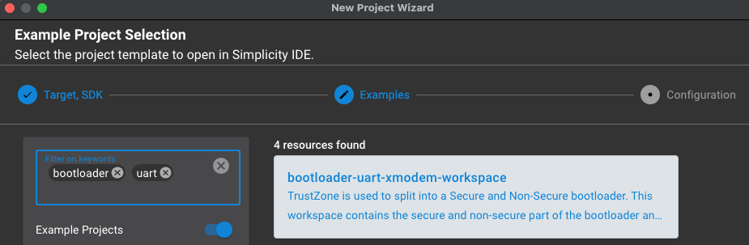
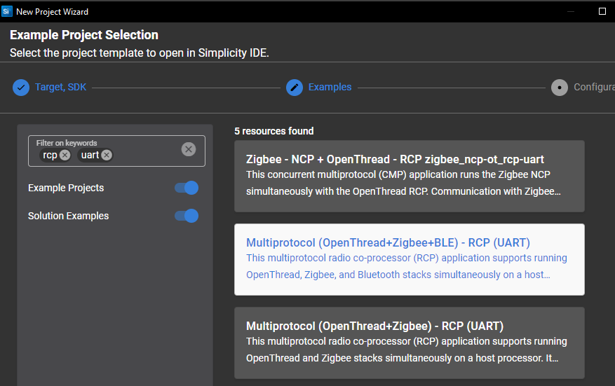
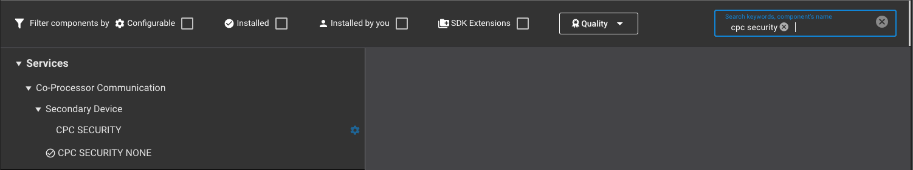
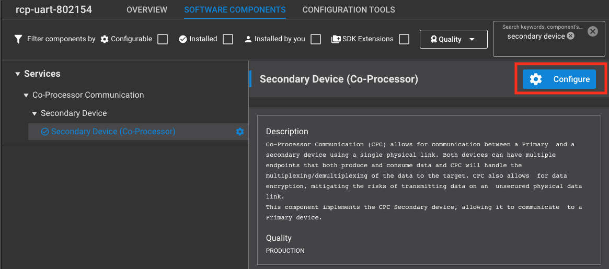
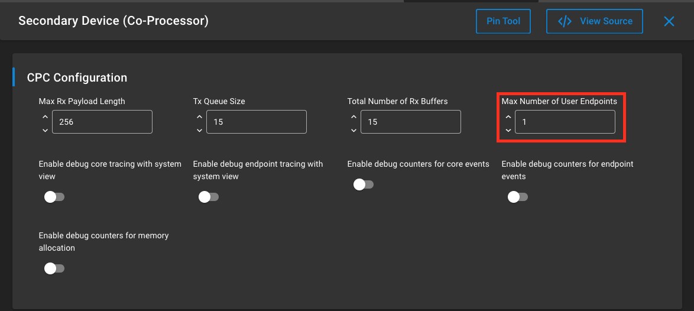

# Custom CPCd commands - RCP Manufacturing Support App
The purpose of this example application is to demonstrate the creation and use of custom cpcd commands as a utility to assist manufacturing operations on an RCP device. 

For the purpose of this example, *primary* and *host* as well as *secondary* and *RCP* will be used interchangeably.

This sample application works by first initializing and connecting to cpcd via the API call: cpc_init. It then opens a user endpoint using the API call: cpc_open_endpoint. 

Commands that wish to write to the RCP from the host will use: cpc_write_endpoint

When writing, the maximum buffer size is determined by the secondary and writing buffers larger than this limit will fail. This value can be queried with cpc_get_endpoint_max_write_size.

Commands that involve reading data from the RCP on the Host will use: cpc_read_endpoint

When reading, the buffer must be at least SL_CPC_READ_MINIMUM_SIZE bytes. 

Both APIs will return a negative value in case of error, otherwise it will return the number of bytes read/written.

Note that we are not using encryption on the CPC endpoint in order to facilitate development and debugging. In a production environment, encryption is *strongly recommended*.

## Usage
This tutorial will explain the steps to run this simple custom commands application. It uses the following components:
### Hardware
* 1x WPK (brd 4002A) + MG21 (brd 4181B)
* 1x Raspberry Pi 4 with [CPCd](https://github.com/SiliconLabs/cpc-daemon) installed

### Software 
* Simplicity Studio v5
* GSDK 4.4.0
* cpc-daemon 4.4.0

### On the Secondary (RCP)
1. Build and flash a bootloader (in this case: bootloader-uart-xmodem)
   

2. Create a new multi-protocol RCP sample app (OpenThread+Zigbee+BLE)
   
   then in the RCP .slcp file make the following changes under "the software components" tab:

    i. Turn off cpc security (by installing CPC Security None)
    

    ii. In Secondary Device (Co-Processor) > Configure > Max Number of User Endpoints should be incremented from 0 to at least 1
    
    

    iii. Add the following files from the src/RCP folder to your project in Simplicity studio
      * *cpc_custom.c*
      * *cpc_custom.h* 
      * *cpc_commands.h*
  
    Iv. Replace the *app.c* in your Simplicity Studio project with the *app.c* in the src/RCP folder

3. Build the project in SImplicity Studio and flash the binary to the RCP device.
4. Connect the RCP to the Host using a serial connection. In this example, the USB port of the WSTK with the 4181B radio board installed is connected to one of the USB ports of the Raspberry Pi.

### On the Primary (Host)
1. Copy '*custom_cpc_host*' directory to the host. This can be done using something like *scp*
2. Ssh to the host
3. Cd to the *custom_cpc_host* directory
4. Run the 'make' command
5. Modify the cpc.conf file (/usr/local/etc/cpcd.conf) to disable encryption:
```
# Disable the encryption over CPC endpoints
# Optional, defaults false
disable_encryption: true 
```
6. The cpc.conf file also needs to point to the serial port connected to the RCP (default shown below):
```
# UART device file
# Mandatory if uart chosen, ignored if spi chosen
uart_device_file: /dev/ttyACM0
```
7. Start cpcd (/usr/local/bin/cpcd)
8. Run the host app ( ./exe/custom_cpc_host)

### On the application
./exe/custom_cpc_host -h will print the help/usage info.

```
--help        
-h                         Prints help message.
--cust_version             Returns 32-but customer version defined in the RCP firmware application (CUSTOMER_VERSION).
--se_version               Returns the Secure Element version on the series 2 device running the RCP firmware. 
--get_ctune_token          Reads the CTUNE manufacturing token stored in userdata flash on the RCP target. This is a 16-bit value and will 
                             be FF FF when not already flashed/programmed 
--set_ctune_token <value>  Writes the CTUNE manufacturing token stored in userdata flash on the RCP target. Note that if the CTUNE 
                             manufacturing token is already written, this call will fail as the value can only be written if blank. 
--get_ctune_value          Reads the CTUNE register value currently set in firmware running on the RCP target. This is a 16-bit value
--set_ctune_value <value>  Sets the CTUNE register value in firmware running on the RCP target. This is a 16-bit value
                             NOTE: The radio needs to be in idle mode for this command to succeeed
--gpio_write <value>       Writes the value of the GPIO pins(s) as determined by the RCP firmware. In the example firmware, 
                             value="1" turns on the LED on the BRD4181B and value="0" turns it off.
--erase_userdata_page      Erase the page on the RCP device containing the manfacturing tokens, including the CTUNE manufacturing token. 
                             This allows a previously written CTUNE manufacturing token to be written to a new value.
                             WARNING - any other values stored in the userdata page will also be erased, so use caution
--tone_start               Enable a CW tone on the transmitter of the RCP at the 802.15.4 channel defined in the RCP firmware and at
                             a default power level. 
--tone_stop                Disable the CW tone on the transmitter of the RCP.
--version                  Prints the version of the host application.
```

### Notes
1. Upon boot or power up, the CTUNE value will be set according to the CTUNE manufacturing token (if present). If not present, the RCP firmware will set the default CTUNE value on power up. The CTUNE value can be changed with commands at runtime, but will always revert to the default (either CTUNE manufacturing token or RCP firmware default) on power up / reset.

2. The CTUNE manufacturing token can not be overwritten if it is already programmed. The userdata flash page (in which the CTUNE manufacturing token resides) has to be erased in order to flash a new CTUNE manufacturing token. Use caution when doing this, as other tokens or data may be stored in the userdata flash page which would also be erased.

3. When running the CTUNE/tone commands, it's strongly recommended to only be running cpcd and to make sure zigbeed, otbr, or any other CPC client that could be activating the radio is not running. The CTUNE/tone commands require the radio to be idle, and the main way to guarantee this is to only have custom_cpc_host and cpcd running. Also note that the CTUNE value cannot be written while the tone is running. The tone needs to be stopped prior to setting the CTUNE value.

4. The CW RF output from the --tone_start command defaults to 802.15.4 channel 11, which is settable by a #define in the RCP firmware source. There is currently no way to set the power level of the CW output.

5. As currently implemented, the return value for multi-byte values is printed to the console byte-by-byte in litte endian byte order. So for example, a CTUNE value of 0xA5 will be printed as 0xA5 0x00. 

6. If SWODEBUG is #defined as 1 in the RCP firmware, some debug messages are printed to the SWO console. Viewing these messages requires a debugger connection between the RCP MCU and a WSTK or other debugger. The SWO console of the Simplicity Commander tool works well for this. SWO debug does require the addition of two components to the RCP firmware project: Services->IO Stream->Driver->IO Stream: SWO and Services->IO Stream->IO Stream: Retarget STDIO.

## Examples

1. Reading a blank CTUNE token from a device:
```
$ ./exe/custom_cpc_host --get_ctune_token
Reply to command 0x3, len=2: 0xff 0xff 
```

2. Writing the CTUNE token to 0x00a5:
```
$ ./exe/custom_cpc_host --set_ctune_token 0xa5
Reply to command 0x4, len=2: 0x0 0x0 
```

3. Reading the CTUNE token just written:
```
./exe/custom_cpc_host --get_ctune_token
Reply to command 0x3, len=2: 0xa5 0x0
```

4. Error (non-zero status) returned from trying to write the CTUNE token when it is not blank:
```
$ ./exe/custom_cpc_host --set_ctune_token 0xa5
Reply to command 0x4, len=2: 0x1 0x0 
```
5. Erasing the userdata page (including the CTUNE token):
```
$ ./exe/custom_cpc_host --erase_userdata_page
Reply to command 0xa, len=2: 0x0 0x0 
```

6. Turn on the LED on the radio board:
```
$ ./exe/custom_cpc_host --gpio_write 1
Reply to command 0x9, len=2: 0x0 0x0 
```

7. Turn off the LED on the radio board:
```
$ ./exe/custom_cpc_host --gpio_write 0
Reply to command 0x9, len=2: 0x0 0x0 
```

8. Set the CTUNE register value at run-time to 0x50:
```
$ ./exe/custom_cpc_host --set_ctune_value 0x50
Reply to command 0x6, len=1: 0x0 
```

9. Output a CW tone on 802.15.4 channel 11:
```
$ ./exe/custom_cpc_host --tone_start
Reply to command 0x7, len=1: 0x0 
```

10. Setting the CTUNE value while the tone is running results in an error (non-zero return value):
```
./exe/custom_cpc_host --set_ctune_value 0x50
Reply to command 0x6, len=1: 0x2 
```

11. Stop the CW tone (in order to set a new CTUNE register value or write the CTUNE manufacturing token):
```
$ ./exe/custom_cpc_host --tone_stop
Reply to command 0x8, len=1: 0x0 
```

## Disclaimer
The Gecko SDK suite supports development with Silicon Labs IoT SoC and module devices. Unless otherwise specified in the specific directory, all examples are considered to be EXPERIMENTAL QUALITY which implies that the code provided in the repos has not been formally tested and is provided as-is. It is not suitable for production environments without testing and validation by the end user. In addition, this code may not be maintained and there may be no bug maintenance planned for these resources. Silicon Labs may update projects from time to time.